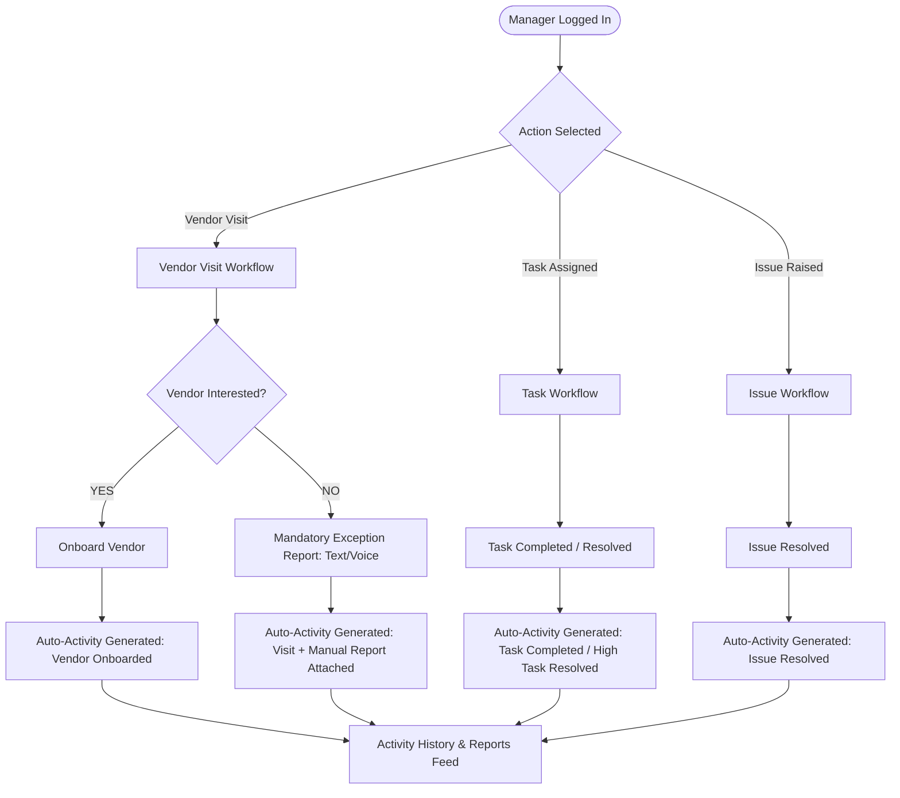

# 02. Business Workflow Specification

## 1. Executive Operational Overview

The FIC Manager App standardizes field operations across multi-tiered geographic territories in India. Operational tasks, vendor visits, task completions, and issue resolutions automatically generate immutable activity log records.

---

## 2. Event-Driven Operational Cycle Diagram

---

## 3. Core Operational Directives

1. **Zero Generic Daily Reports**: Routine field actions (vendor onboarding, visits, task acceptances/completions, issue resolutions) generate **automatic activity logs**. No manual end-of-day daily report form exists in the application.
2. **Targeted Exception Reporting**: Manual reporting is strictly enforced **ONLY** when a non-standard outcome occurs—specifically when a visited vendor declines interest (`Not Interested`).
3. **Audit Integrity**: Every activity record captures exact manager ID, timestamp, entity ID, territory scope context (`stateId`, `districtId`, `divisionId`, `pincodeId`), and system trace data.
