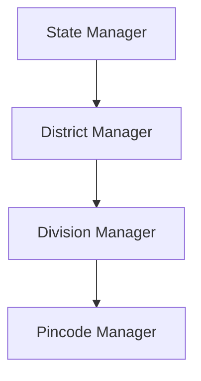

# 03. Manager Hierarchy & Geographic Scope Specification

## 1. Hierarchy Tree Structure

The FIC organizational structure follows a 4-tier geographic cascade:

$$\text{State} \longrightarrow \text{District} \longrightarrow \text{Division} \longrightarrow \text{Pincode}$$

---

## 2. Fixed & Data-Driven Hierarchy Rules

1. **Manager Roles**:
   - **State Manager**: Highest state-level operational authority.
   - **District Manager**: District-level operational manager.
   - **Division Manager**: Division-level operational manager.
   - **Pincode Manager**: Micro-territory field manager.
2. **Division Mandate per State**: Every State contains exactly four geographic divisions:
   - **North**
   - **South**
   - **East**
   - **West**
3. **Division Manager Staffing**: Each Division has exactly **2 Division Managers**.
   - Formula: $4 \text{ Divisions} \times 2 \text{ Managers} = 8 \text{ Division Managers per State}$.
4. **Data-Driven Territories**:
   - The number of **Districts** per State and **Pincodes** per Division are dynamic and data-driven from the backend database.
   - **CRITICAL**: The application code MUST NOT hardcode district or pincode counts.
5. **Territory Scope Authorization Constraint**:
   - A manager at any tier has visibility strictly limited to entities (vendors, sub-managers, tasks, activities) within their assigned subtree.
   - **CRITICAL**: Territory scope authorization MUST be enforced by backend API middleware. The mobile UI is never the security boundary.

---

## 3. Manager Roles Summary Table

| Role | Geographic Level | Parent Scope | Subordinate Scope Visibility |
| :--- | :--- | :--- | :--- |
| **State Manager** | State | Entire State | All Districts, Divisions, Pincodes in State |
| **District Manager** | District | State | All Divisions and Pincodes in District |
| **Division Manager** | Division (North/South/East/West) | District | All Pincodes assigned to Division |
| **Pincode Manager** | Pincode | Division | Assigned Pincode area only |

---

## 4. Hierarchy Workflow Audit Breakdown (12 Audit Items)

1. **Entities Involved**: `Manager`, `Territory` (`State`, `District`, `Division`, `Pincode`).
2. **Valid States**: Active Manager account mapped to valid geographic scope IDs.
3. **Valid Transitions**: Re-assignment of manager territory scope by Web Admin.
4. **Invalid Transitions**: Scope expansion or escalation requested directly from mobile client (blocked by API gateway).
5. **Actor/Role Allowed**: Mobile user views read-only hierarchy data within scope; Admin manages scope on Web Portal.
6. **Territory Restriction**: Mandatory filtering by `state_id`, `district_id`, `division_id`, `pincode_id`.
7. **Automatic Activity Generated**: N/A (Manager creation/edits occur on Web Admin).
8. **Notification Generated**: Notification sent to manager if territory assignment is changed by Admin.
9. **Report Requirement**: None.
10. **Required API Operation**: `GET /api/v1/managers/directory` (Read-Only).
11. **Required Database Fields**: `id`, `name`, `email`, `role`, `state_id`, `district_id`, `division_id`, `pincode_id`.
12. **Audit Information**: JWT claim payload containing role and scope attributes logged on every API access.
