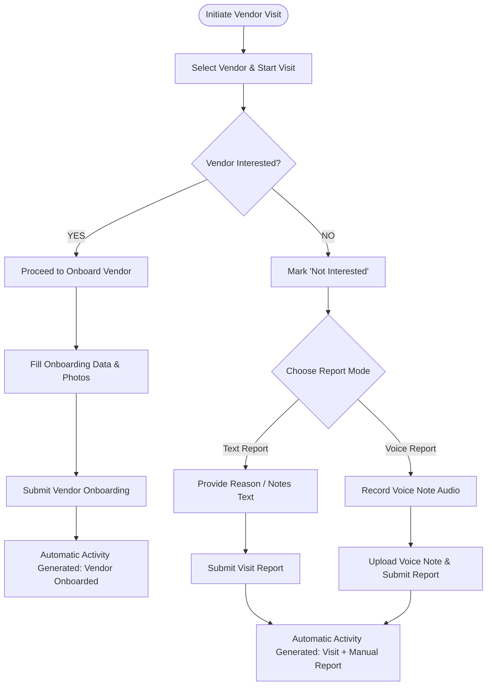

# 05. Vendor Workflow & Onboarding Specification

## 1. Overview

Managers interact with vendors through search, filtering, onboarding, and field visits within their assigned geographic scope.

---

## 2. Onboarding Information Model

When onboarding a vendor, the following fields are collected:

- **Vendor Name**: Full legal name of contact person.
- **Contact Person**: Primary contact title / name.
- **Phone**: 10-digit mobile number.
- **Email**: Email address.
- **Business Name**: Trade / Shop name.
- **Category**: Retail, Wholesale, Distributor, Manufacturer, Service.
- **Business Type**: Proprietorship, Partnership, Pvt Ltd, Unregistered.
- **Address & Territory**: Street Address, State, District, Division, Pincode.
- **Media**: Shop photo.
- **Documents**: Optional GSTIN, PAN, or FSSAI photo upload where applicable.

---

## 3. Vendor Visit Decision Workflow Diagram

---

## 4. Vendor Onboarding Audit Breakdown (12 Audit Items)

1. **Entities Involved**: `Vendor`, `Manager`, `Activity`.
2. **Valid States**: `LEAD` $\rightarrow$ `ONBOARDED`.
3. **Valid Transitions**: Onboard Vendor form submission.
4. **Invalid Transitions**: Attempting to onboard a vendor outside manager's assigned territory scope.
5. **Actor/Role Allowed**: State, District, Division, or Pincode Manager within scope.
6. **Territory Restriction**: Mandatory `state_id`, `district_id`, `division_id`, `pincode_id` scope match.
7. **Automatic Activity Generated**: `VENDOR_ONBOARDED` automatically created upon successful onboarding.
8. **Notification Generated**: Notification sent to reporting manager if configured.
9. **Report Requirement**: None for successful onboarding (auto-activity sufficient).
10. **Required API Operation**: `POST /api/v1/vendors`.
11. **Required Database Fields**: `id`, `business_name`, `vendor_name`, `phone`, `category`, `address`, `state_id`, `district_id`, `division_id`, `pincode_id`, `status`, `created_by_id`, `created_at`.
12. **Audit Information**: Created timestamp, creating manager ID, geolocation metadata recorded.

---

## 5. Vendor Visit Audit Breakdown (12 Audit Items)

1. **Entities Involved**: `Vendor`, `Manager`, `Activity`, `Report`.
2. **Valid States**: `LEAD` / `VISITED` $\rightarrow$ `ONBOARDED` (if Interested) OR `NOT_INTERESTED` (if Not Interested).
3. **Valid Transitions**:
   - Interested $\rightarrow$ Onboard Vendor form completion.
   - Not Interested $\rightarrow$ Automatic activity recorded + mandatory Exception Report submitted.
4. **Invalid Transitions**: Marking "Not Interested" without attaching a Text or Voice exception report (blocked by client and server).
5. **Actor/Role Allowed**: State, District, Division, or Pincode Manager within scope.
6. **Territory Restriction**: Vendor territory scope must match manager JWT claims.
7. **Automatic Activity Generated**:
   - `VENDOR_VISIT_INTERESTED` (if Interested).
   - `VENDOR_VISIT_NOT_INTERESTED` (if Not Interested).
8. **Notification Generated**: Alert sent to supervisor if vendor marked Not Interested repeatedly in a division.
9. **Report Requirement**:
   - Interested: **No manual daily report form**.
   - Not Interested: **Mandatory Exception Report** (Text or Voice note).
10. **Required API Operation**: `POST /api/v1/vendors/:id/visit` & `POST /api/v1/reports/exception`.
11. **Required Database Fields**: `id`, `activity_id`, `manager_id`, `vendor_id`, `report_type`, `text_notes`, `voice_url`, `submitted_at`.
12. **Audit Information**: Visit timestamp, manager ID, vendor ID, report type, voice audio file metadata.
