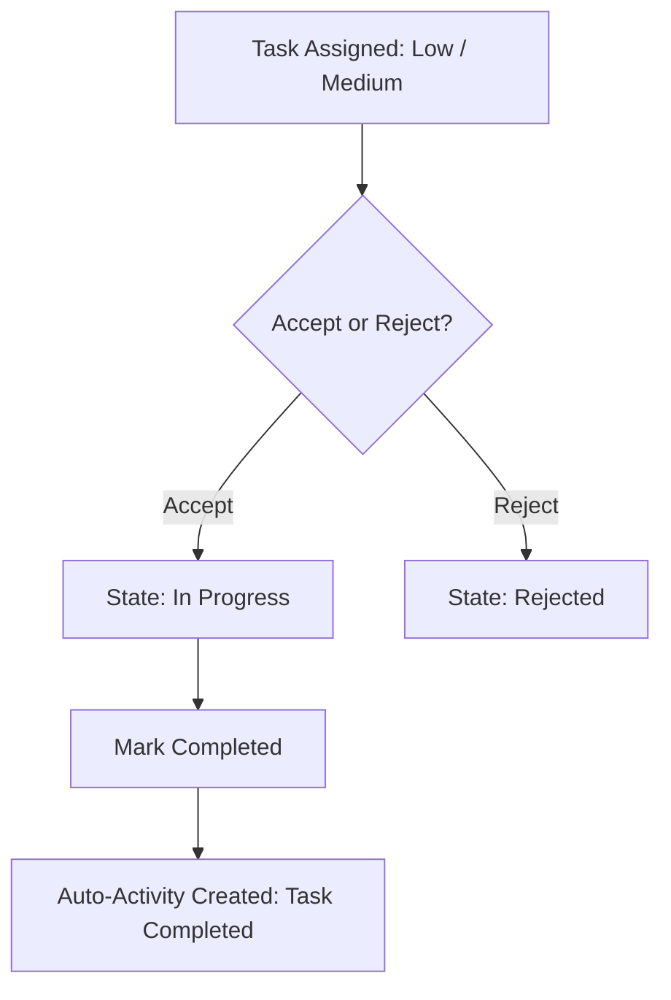
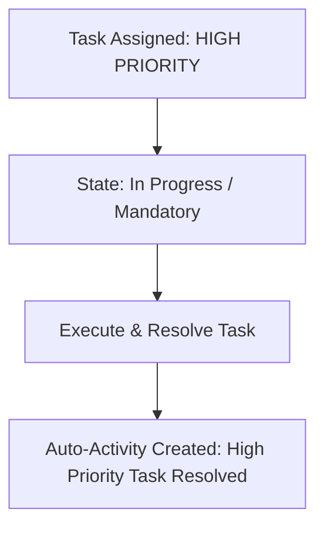

# 06. Task Priority Rules & Workflow Specification

## 1. Priority Classification

Tasks are classified into exactly three priority levels:

1. **Low**
2. **Medium**
3. **High**

---

## 2. Priority Rules & State Transitions

### LOW and MEDIUM Priority Task Workflow

- **Assigned** $\rightarrow$ **Accept** OR **Reject**
- If **Accepted**: State changes to **In Progress** $\rightarrow$ **Completed**.
- If **Completed**: Automatic activity created (`TASK_COMPLETED`).
- If **Rejected**: State changes to **Rejected** (reason recorded).

---

### HIGH Priority Task Workflow (Mandatory Resolution)

- **Assigned** $\rightarrow$ **In Progress** $\rightarrow$ **Resolved**
- **CRITICAL RULE**: High-priority tasks **DO NOT** provide the normal Accept/Reject workflow.
- High-priority tasks **MUST** be resolved by the assigned manager.
- Resolution automatically creates an activity (`HIGH_TASK_RESOLVED`).

---

## 3. Low & Medium Priority Task Audit Breakdown (12 Audit Items)

1. **Entities Involved**: `Task`, `Manager`, `Activity`.
2. **Valid States**: `ASSIGNED`, `ACCEPTED`, `REJECTED`, `IN_PROGRESS`, `COMPLETED`.
3. **Valid Transitions**:
   - `ASSIGNED` $\rightarrow$ `ACCEPTED` or `REJECTED`.
   - `ACCEPTED` $\rightarrow$ `IN_PROGRESS` $\rightarrow$ `COMPLETED`.
4. **Invalid Transitions**:
   - `COMPLETED` $\rightarrow$ `REJECTED` or `ACCEPTED` (Terminal state).
   - `REJECTED` $\rightarrow$ `COMPLETED` (Must be re-assigned first).
5. **Actor/Role Allowed**: Assigned Manager within scope.
6. **Territory Restriction**: Task assigned manager ID must match authenticated manager ID.
7. **Automatic Activity Generated**: `TASK_ACCEPTED` upon acceptance; `TASK_COMPLETED` upon completion.
8. **Notification Generated**: Alert sent to assigning manager upon completion or rejection.
9. **Report Requirement**: No manual daily report required (auto-activity generated).
10. **Required API Operation**: `PATCH /api/v1/tasks/:id/status`.
11. **Required Database Fields**: `id`, `title`, `description`, `priority`, `assigned_manager_id`, `status`, `rejection_reason`, `created_at`, `completed_at`.
12. **Audit Information**: Timestamp of assignment, acceptance, rejection, or completion.

---

## 4. High Priority Task Audit Breakdown (12 Audit Items)

1. **Entities Involved**: `Task`, `Manager`, `Activity`.
2. **Valid States**: `ASSIGNED` / `IN_PROGRESS`, `RESOLVED`.
3. **Valid Transitions**: `ASSIGNED` / `IN_PROGRESS` $\rightarrow$ `RESOLVED`.
4. **Invalid Transitions**:
   - `HIGH Priority Task` + `REJECT` action $\rightarrow$ **BLOCKED** (`422 Unprocessable Entity`). High priority tasks cannot be rejected.
   - `HIGH Priority Task` + `ACCEPT` action $\rightarrow$ **BLOCKED** (Accept/Reject options do not exist for High priority tasks).
5. **Actor/Role Allowed**: Assigned Manager within scope.
6. **Territory Restriction**: Must match assigned manager territory.
7. **Automatic Activity Generated**: `HIGH_TASK_RESOLVED` automatically created upon resolution.
8. **Notification Generated**: High priority task assigned alert; High priority resolved alert to supervisor.
9. **Report Requirement**: Resolution narrative required before marking resolved; no separate daily report.
10. **Required API Operation**: `PATCH /api/v1/tasks/:id/status`.
11. **Required Database Fields**: `id`, `title`, `description`, `priority`, `assigned_manager_id`, `status`, `completed_at`.
12. **Audit Information**: Escalation timestamp, assigned timestamp, resolution timestamp.
