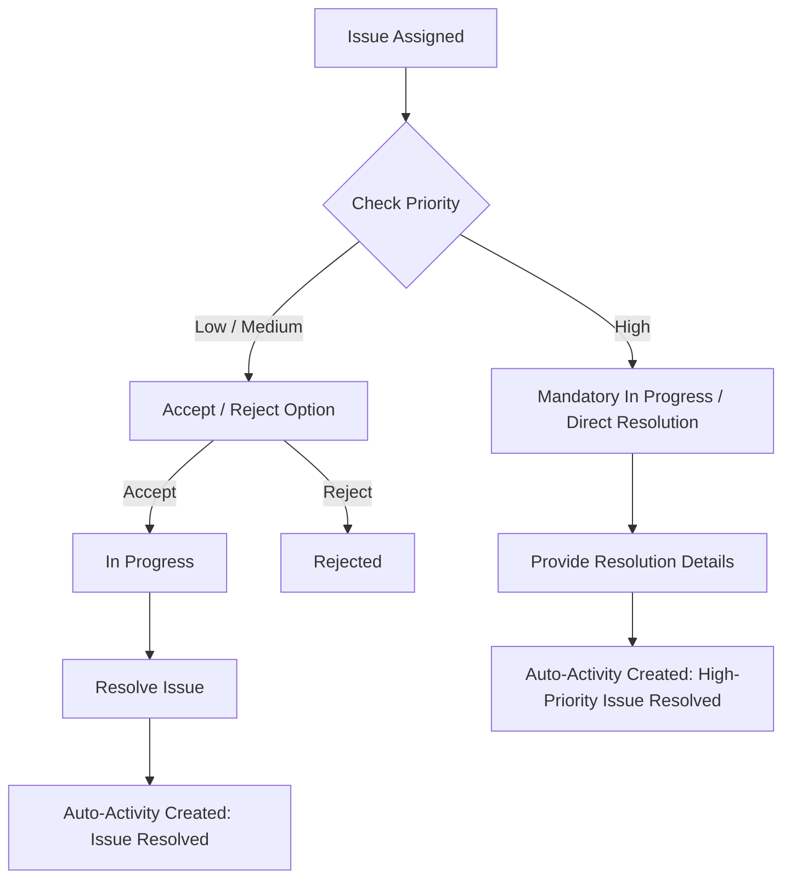

# 07. Issue Priority Rules & Workflow Specification

## 1. Overview & Classification

Issues track operational impediments, payment discrepancies, vendor complaints, or field logistical failures.
Issues use the exact three priority tiers:

1. **Low**
2. **Medium**
3. **High**

---

## 2. Priority Rules & State Transitions

### Low & Medium Priority Issue Workflow

- Support standard **Accept** / **Reject** workflow.
- If Accepted: `In Progress` $\rightarrow$ `Resolved`.
- Resolving an issue automatically creates an activity (`ISSUE_RESOLVED`).

### High Priority Issue Workflow (Mandatory Resolution)

- **CRITICAL RULE**: High-priority issues **MUST** be resolved by the manager.
- High-priority issues **DO NOT** provide the normal Accept/Reject workflow.
- Assigned $\rightarrow$ `In Progress` $\rightarrow$ `Resolved`.
- Invalid state transitions (such as attempting to reject a High Priority issue) MUST be blocked.

---

## 3. Low & Medium Priority Issue Audit Breakdown (12 Audit Items)

1. **Entities Involved**: `Issue`, `Manager`, `Vendor` (optional), `Activity`.
2. **Valid States**: `OPEN`, `ACCEPTED`, `REJECTED`, `IN_PROGRESS`, `RESOLVED`.
3. **Valid Transitions**:
   - `OPEN` $\rightarrow$ `ACCEPTED` or `REJECTED`.
   - `ACCEPTED` $\rightarrow$ `IN_PROGRESS` $\rightarrow$ `RESOLVED`.
4. **Invalid Transitions**:
   - `RESOLVED` $\rightarrow$ `REJECTED` (Terminal state).
   - `REJECTED` $\rightarrow$ `RESOLVED` (Must be re-opened by backend first).
5. **Actor/Role Allowed**: Assigned Manager within scope.
6. **Territory Restriction**: Issue assigned manager ID must match authenticated manager ID.
7. **Automatic Activity Generated**: `ISSUE_RESOLVED` automatically created upon resolution.
8. **Notification Generated**: Alert sent to reporter upon resolution.
9. **Report Requirement**: Resolution text required; no separate daily report.
10. **Required API Operation**: `PATCH /api/v1/issues/:id/resolve`.
11. **Required Database Fields**: `id`, `title`, `description`, `priority`, `assigned_manager_id`, `vendor_id`, `status`, `resolution_text`, `created_at`, `resolved_at`.
12. **Audit Information**: Creation timestamp, assigned timestamp, resolution timestamp.

---

## 4. High Priority Issue Audit Breakdown (12 Audit Items)

1. **Entities Involved**: `Issue`, `Manager`, `Vendor` (optional), `Activity`.
2. **Valid States**: `OPEN` / `IN_PROGRESS`, `RESOLVED`.
3. **Valid Transitions**: `OPEN` / `IN_PROGRESS` $\rightarrow$ `RESOLVED`.
4. **Invalid Transitions**:
   - `HIGH Priority Issue` + `REJECT` action $\rightarrow$ **BLOCKED** (`422 Unprocessable Entity`). High priority issues cannot be rejected.
   - `HIGH Priority Issue` + `ACCEPT` action $\rightarrow$ **BLOCKED** (Accept/Reject options omitted).
5. **Actor/Role Allowed**: Assigned Manager within scope.
6. **Territory Restriction**: Must match assigned manager territory scope.
7. **Automatic Activity Generated**: `ISSUE_RESOLVED` automatically created upon resolution.
8. **Notification Generated**: Urgent notification on assignment; notification on resolution.
9. **Report Requirement**: Detailed resolution narrative mandatory; no separate daily report.
10. **Required API Operation**: `PATCH /api/v1/issues/:id/resolve`.
11. **Required Database Fields**: `id`, `title`, `description`, `priority`, `assigned_manager_id`, `status`, `resolution_text`, `resolved_at`.
12. **Audit Information**: Escalation log, assigned timestamp, resolution timestamp.
