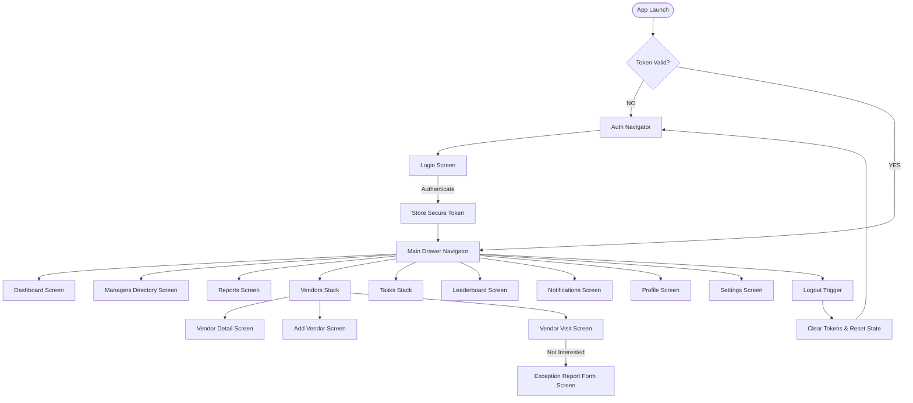

# 12. Navigation Flow & Authentication Guard Architecture

## 1. Overall Navigation Tree

---

## 2. Authentication Guard Rule

- **Unauthenticated State**: Only `AuthStack` screens (`LoginScreen`) are mounted.
- **Authenticated State**: `AuthStack` is unmounted and replaced by `MainDrawerNavigator`.
- **Session Expiry (401 Unauthorized)**: Automatic token refresh attempted; if failed, state automatically switches back to `AuthStack` and clears stored tokens.
