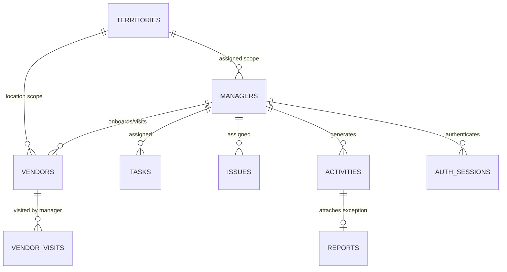

# 14. Database Schema Proposal (Neutral Relational / Logical ERD)

## 1. Logical Entity-Relationship Overview

The schema is neutral and compatible with PostgreSQL, MySQL, or document store mapping with relational indexes.

---

## 2. Table Specifications & Index Recommendations

### Table: `states`

- `id`: VARCHAR(36) PRIMARY KEY
- `name`: VARCHAR(100) NOT NULL
- `state_code`: VARCHAR(10) UNIQUE NOT NULL
- `created_at`: TIMESTAMP NOT NULL DEFAULT CURRENT_TIMESTAMP

---

### Table: `districts`

- `id`: VARCHAR(36) PRIMARY KEY
- `state_id`: VARCHAR(36) NOT NULL FOREIGN KEY REFERENCES `states(id)`
- `name`: VARCHAR(100) NOT NULL
- `district_code`: VARCHAR(20) NOT NULL
- **Index**: `idx_districts_state (state_id)`

---

### Table: `divisions`

- `id`: VARCHAR(36) PRIMARY KEY
- `state_id`: VARCHAR(36) NOT NULL FOREIGN KEY REFERENCES `states(id)`
- `district_id`: VARCHAR(36) NOT NULL FOREIGN KEY REFERENCES `districts(id)`
- `name`: VARCHAR(20) NOT NULL -- Enum: NORTH, SOUTH, EAST, WEST
- **Index**: `idx_divisions_state_district (state_id, district_id)`

---

### Table: `pincodes`

- `id`: VARCHAR(36) PRIMARY KEY
- `state_id`: VARCHAR(36) NOT NULL FOREIGN KEY REFERENCES `states(id)`
- `district_id`: VARCHAR(36) NOT NULL FOREIGN KEY REFERENCES `districts(id)`
- `division_id`: VARCHAR(36) NOT NULL FOREIGN KEY REFERENCES `divisions(id)`
- `pincode_number`: VARCHAR(10) NOT NULL
- `area_name`: VARCHAR(100) NOT NULL
- **Index**: `idx_pincodes_number (pincode_number)`, `idx_pincodes_division (division_id)`

---

### Table: `managers`

- `id`: VARCHAR(36) PRIMARY KEY
- `name`: VARCHAR(150) NOT NULL
- `email`: VARCHAR(150) UNIQUE NOT NULL
- `phone`: VARCHAR(20) NOT NULL
- `role`: VARCHAR(30) NOT NULL -- Enum: STATE_MANAGER, DISTRICT_MANAGER, DIVISION_MANAGER, PINCODE_MANAGER
- `state_id`: VARCHAR(36) NOT NULL FOREIGN KEY REFERENCES `states(id)`
- `district_id`: VARCHAR(36) NULLABLE FOREIGN KEY REFERENCES `districts(id)`
- `division_id`: VARCHAR(36) NULLABLE FOREIGN KEY REFERENCES `divisions(id)`
- `pincode_id`: VARCHAR(36) NULLABLE FOREIGN KEY REFERENCES `pincodes(id)`
- `profile_image`: TEXT NULLABLE
- `created_at`: TIMESTAMP NOT NULL DEFAULT CURRENT_TIMESTAMP
- `updated_at`: TIMESTAMP NOT NULL DEFAULT CURRENT_TIMESTAMP
- **Indexes**:
  - `idx_managers_scope (state_id, district_id, division_id, pincode_id)`: Accelerates territory-based security scope queries.
  - `idx_managers_role (role)`: Accelerates directory role filtering.

---

### Table: `vendors`

- `id`: VARCHAR(36) PRIMARY KEY
- `business_name`: VARCHAR(200) NOT NULL
- `vendor_name`: VARCHAR(150) NOT NULL
- `phone`: VARCHAR(20) NOT NULL
- `email`: VARCHAR(150) NULLABLE
- `category`: VARCHAR(50) NOT NULL
- `business_type`: VARCHAR(50) NOT NULL
- `address`: TEXT NOT NULL
- `state_id`: VARCHAR(36) NOT NULL FOREIGN KEY REFERENCES `states(id)`
- `district_id`: VARCHAR(36) NOT NULL FOREIGN KEY REFERENCES `districts(id)`
- `division_id`: VARCHAR(36) NOT NULL FOREIGN KEY REFERENCES `divisions(id)`
- `pincode_id`: VARCHAR(36) NOT NULL FOREIGN KEY REFERENCES `pincodes(id)`
- `status`: VARCHAR(30) NOT NULL -- Enum: LEAD, VISITED, ONBOARDED, NOT_INTERESTED
- `created_by_id`: VARCHAR(36) FOREIGN KEY REFERENCES `managers(id)`
- `created_at`: TIMESTAMP NOT NULL DEFAULT CURRENT_TIMESTAMP
- `updated_at`: TIMESTAMP NOT NULL DEFAULT CURRENT_TIMESTAMP
- **Indexes**:
  - `idx_vendors_territory (state_id, district_id, division_id, pincode_id)`: Mandatory for territory filter execution.
  - `idx_vendors_status (status)`: Accelerates status filter dropdown queries.

---

### Table: `vendor_visits`

- `id`: VARCHAR(36) PRIMARY KEY
- `vendor_id`: VARCHAR(36) NOT NULL FOREIGN KEY REFERENCES `vendors(id)`
- `manager_id`: VARCHAR(36) NOT NULL FOREIGN KEY REFERENCES `managers(id)`
- `activity_id`: VARCHAR(36) NOT NULL FOREIGN KEY REFERENCES `activities(id)`
- `visit_time`: TIMESTAMP NOT NULL DEFAULT CURRENT_TIMESTAMP
- `interested`: BOOLEAN NOT NULL
- `notes`: TEXT NULLABLE
- `state_id`: VARCHAR(36) NOT NULL
- `district_id`: VARCHAR(36) NOT NULL
- `division_id`: VARCHAR(36) NOT NULL
- `pincode_id`: VARCHAR(36) NOT NULL
- **Indexes**: `idx_vendor_visits_vendor (vendor_id)`, `idx_vendor_visits_manager (manager_id, visit_time DESC)`

---

### Table: `tasks`

- `id`: VARCHAR(36) PRIMARY KEY
- `title`: VARCHAR(255) NOT NULL
- `description`: TEXT NOT NULL
- `priority`: VARCHAR(20) NOT NULL -- Enum: LOW, MEDIUM, HIGH
- `assigned_manager_id`: VARCHAR(36) FOREIGN KEY REFERENCES `managers(id)`
- `vendor_id`: VARCHAR(36) NULLABLE FOREIGN KEY REFERENCES `vendors(id)`
- `status`: VARCHAR(30) NOT NULL -- Enum: ASSIGNED, ACCEPTED, REJECTED, IN_PROGRESS, COMPLETED, RESOLVED
- `rejection_reason`: TEXT NULLABLE
- `created_at`: TIMESTAMP NOT NULL DEFAULT CURRENT_TIMESTAMP
- `updated_at`: TIMESTAMP NOT NULL DEFAULT CURRENT_TIMESTAMP
- `completed_at`: TIMESTAMP NULLABLE
- **Indexes**:
  - `idx_tasks_manager_status (assigned_manager_id, status)`: Accelerates assigned task list queries.
  - `idx_tasks_priority (priority)`: Accelerates priority filtering.

---

### Table: `issues`

- `id`: VARCHAR(36) PRIMARY KEY
- `title`: VARCHAR(255) NOT NULL
- `description`: TEXT NOT NULL
- `priority`: VARCHAR(20) NOT NULL -- Enum: LOW, MEDIUM, HIGH
- `assigned_manager_id`: VARCHAR(36) FOREIGN KEY REFERENCES `managers(id)`
- `vendor_id`: VARCHAR(36) NULLABLE FOREIGN KEY REFERENCES `vendors(id)`
- `status`: VARCHAR(30) NOT NULL -- Enum: OPEN, ACCEPTED, REJECTED, IN_PROGRESS, RESOLVED
- `resolution_text`: TEXT NULLABLE
- `created_at`: TIMESTAMP NOT NULL DEFAULT CURRENT_TIMESTAMP
- `updated_at`: TIMESTAMP NOT NULL DEFAULT CURRENT_TIMESTAMP
- `resolved_at`: TIMESTAMP NULLABLE
- **Indexes**: `idx_issues_manager_priority (assigned_manager_id, priority, status)`

---

### Table: `activities`

- `id`: VARCHAR(36) PRIMARY KEY
- `manager_id`: VARCHAR(36) FOREIGN KEY REFERENCES `managers(id)`
- `activity_type`: VARCHAR(50) NOT NULL
- `entity_id`: VARCHAR(36) NOT NULL
- `entity_name`: VARCHAR(200) NOT NULL
- `timestamp`: TIMESTAMP NOT NULL DEFAULT CURRENT_TIMESTAMP
- `state_id`: VARCHAR(36) NOT NULL
- `district_id`: VARCHAR(36) NOT NULL
- `division_id`: VARCHAR(36) NOT NULL
- `pincode_id`: VARCHAR(36) NOT NULL
- `metadata_json`: JSON NULLABLE
- **Indexes**:
  - `idx_activities_manager_time (manager_id, timestamp DESC)`: Primary index for timeline feed.
  - `idx_activities_territory (state_id, district_id)`: Primary index for territory leaderboard calculations.

---

### Table: `reports`

- `id`: VARCHAR(36) PRIMARY KEY
- `activity_id`: VARCHAR(36) UNIQUE FOREIGN KEY REFERENCES `activities(id)`
- `manager_id`: VARCHAR(36) FOREIGN KEY REFERENCES `managers(id)`
- `vendor_id`: VARCHAR(36) FOREIGN KEY REFERENCES `vendors(id)`
- `report_type`: VARCHAR(20) NOT NULL -- Enum: TEXT, VOICE
- `text_notes`: TEXT NULLABLE
- `voice_url`: TEXT NULLABLE
- `voice_duration_seconds`: INT NULLABLE
- `submitted_at`: TIMESTAMP NOT NULL DEFAULT CURRENT_TIMESTAMP
- **Indexes**: `idx_reports_activity (activity_id)`

---

### Table: `notifications`

- `id`: VARCHAR(36) PRIMARY KEY
- `target_manager_id`: VARCHAR(36) NOT NULL FOREIGN KEY REFERENCES `managers(id)`
- `title`: VARCHAR(200) NOT NULL
- `body`: TEXT NOT NULL
- `priority`: VARCHAR(20) NOT NULL
- `is_read`: BOOLEAN NOT NULL DEFAULT FALSE
- `deep_link_screen`: VARCHAR(100) NULLABLE
- `deep_link_params_json`: JSON NULLABLE
- `created_at`: TIMESTAMP NOT NULL DEFAULT CURRENT_TIMESTAMP
- **Index**: `idx_notifications_target (target_manager_id, is_read, created_at DESC)`

---

### Table: `leaderboard_entries`

- `id`: VARCHAR(36) PRIMARY KEY
- `manager_id`: VARCHAR(36) NOT NULL FOREIGN KEY REFERENCES `managers(id)`
- `rank`: INT NOT NULL
- `score`: INT NOT NULL
- `vendors_onboarded`: INT NOT NULL DEFAULT 0
- `tasks_completed`: INT NOT NULL DEFAULT 0
- `issues_resolved`: INT NOT NULL DEFAULT 0
- `period_start`: TIMESTAMP NOT NULL
- `period_end`: TIMESTAMP NOT NULL
- `updated_at`: TIMESTAMP NOT NULL DEFAULT CURRENT_TIMESTAMP
- **Index**: `idx_leaderboard_rank (period_start, rank)`

---

### Table: `auth_sessions`

- `id`: VARCHAR(36) PRIMARY KEY
- `manager_id`: VARCHAR(36) NOT NULL FOREIGN KEY REFERENCES `managers(id)`
- `token_hash`: VARCHAR(255) NOT NULL
- `refresh_token_hash`: VARCHAR(255) NOT NULL
- `ip_address`: VARCHAR(45) NULLABLE
- `user_agent`: TEXT NULLABLE
- `expires_at`: TIMESTAMP NOT NULL
- `created_at`: TIMESTAMP NOT NULL DEFAULT CURRENT_TIMESTAMP
- **Index**: `idx_auth_sessions_manager (manager_id)`
