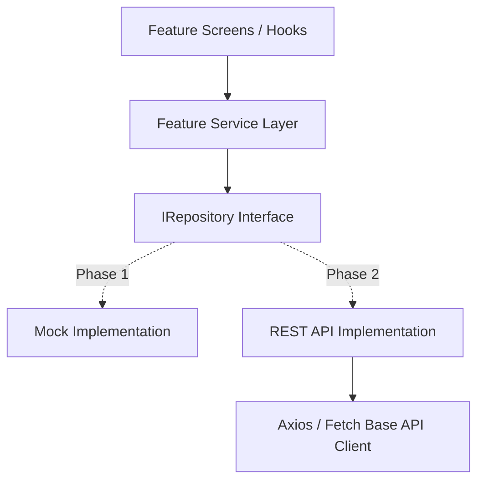

# 21. Backend Integration Plan & Repository Abstraction

## 1. Repository Pattern Strategy

The application UI and features depend strictly on abstract repository interfaces rather than concrete HTTP clients or mock objects.

---

## 2. Mock vs REST API Swap Architecture

To switch the app from mock data to live REST API endpoints:

1. Implement the API repository class (e.g., `ApiVendorRepository implements IVendorRepository`).
2. Update Dependency Injection / Service Locator registry in `src/services/index.ts`.
3. **Zero changes are required in any UI component or feature screen**.
