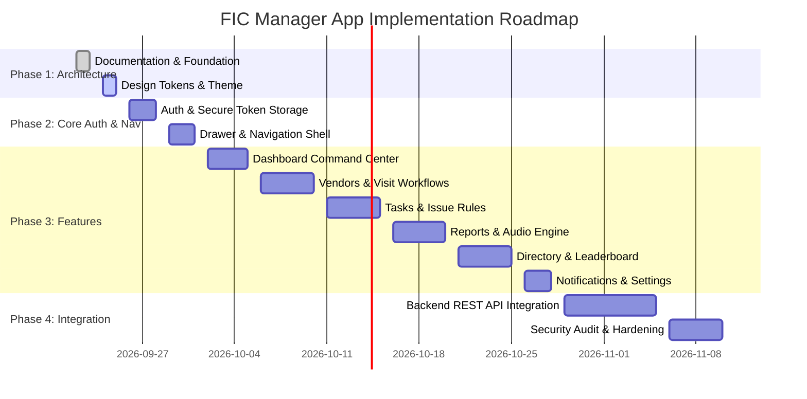

# 22. Phased Development Roadmap

## 1. Incremental Execution Stages

---

## 2. Milestone Summary

1. **Milestone 1 (Current Phase)**: Technical Architecture, Typed Domain Contracts, REST API Proposal, and Documentation.
2. **Milestone 2**: Design System UI Library & Base Drawer Shell.
3. **Milestone 3**: Vendor & Task/Issue Operational Features with Mock Repositories.
4. **Milestone 4**: Exception Voice Reporting & Audio Service Integration.
5. **Milestone 5**: Backend API Integration, Push Notifications, and Android Security Hardening.
