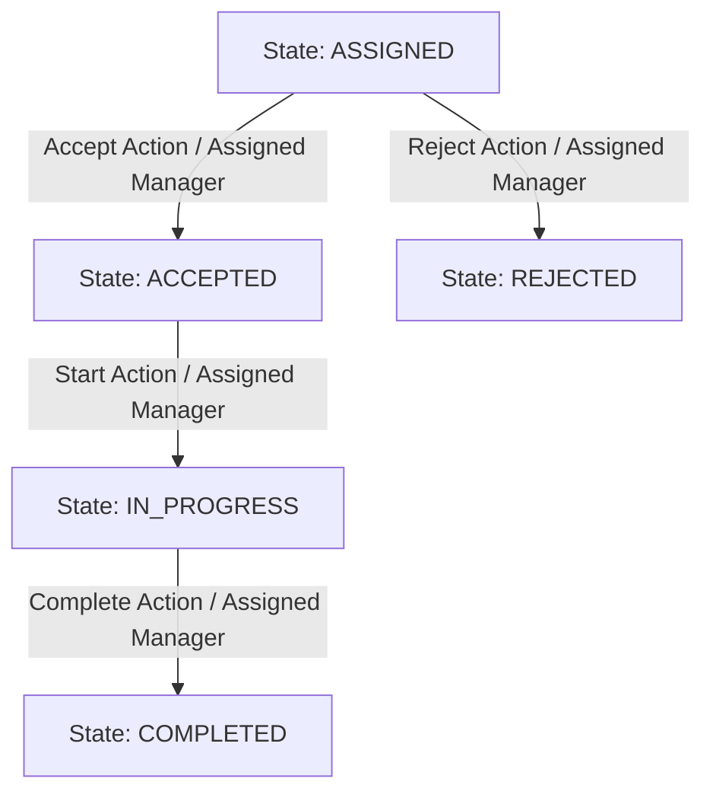
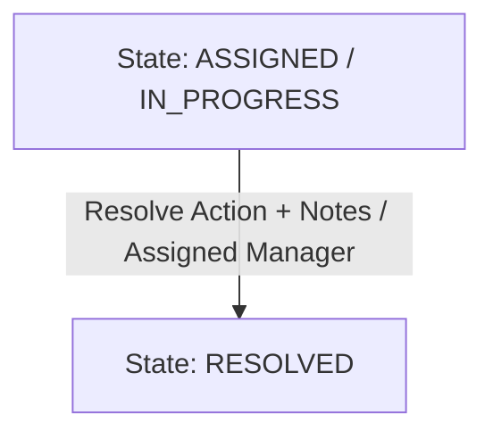
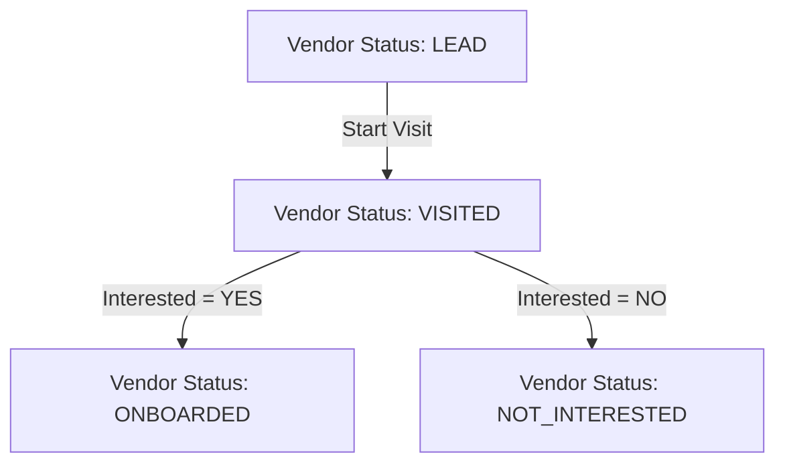

# 23. State Machines & Transition Contracts

## 1. Overview

This document formally specifies the state machines, valid transitions, invalid transitions, authorization constraints, auto-activity triggers, and notification triggers for Tasks, Issues, Vendors, Vendor Visits, and Exception Reports.

---

## 2. Task State Machine

### Priorities

- **LOW**
- **MEDIUM**
- **HIGH**

---

### Low & Medium Priority Task State Machine

#### Valid Transitions (Low / Medium)

1. `ASSIGNED` $\rightarrow$ `ACCEPTED`: Assigned manager accepts task. Auto-activity generated: `TASK_ACCEPTED`.
2. `ASSIGNED` $\rightarrow$ `REJECTED`: Assigned manager rejects task (requires rejection reason).
3. `ACCEPTED` $\rightarrow$ `IN_PROGRESS`: Assigned manager starts task execution.
4. `IN_PROGRESS` $\rightarrow$ `COMPLETED`: Assigned manager marks task completed. Auto-activity generated: `TASK_COMPLETED`.

#### Invalid Transitions (Blocked)

- `COMPLETED` $\rightarrow$ `ACCEPTED` / `REJECTED`: Blocked (`422 Unprocessable Entity`). Terminal state reached.
- `REJECTED` $\rightarrow$ `COMPLETED`: Blocked. Rejected tasks must be re-assigned by backend first.

---

### High Priority Task State Machine (Mandatory Resolution)

> [!IMPORTANT]
> **HIGH PRIORITY MANDATE**:
> High-priority tasks bypass normal Accept/Reject options. High-priority tasks MUST be resolved by the manager.

#### Valid Transitions (High)

1. `ASSIGNED` / `IN_PROGRESS` $\rightarrow$ `RESOLVED`: Assigned manager resolves task with resolution narrative. Auto-activity generated: `HIGH_TASK_RESOLVED`. Notification generated: Alert to supervisor.

#### Invalid High Priority Transitions (Blocked)

- `HIGH Task` + `REJECT` action $\rightarrow$ **BLOCKED** (`422 Unprocessable Entity`: "High priority tasks are mandatory and cannot be rejected.").
- `HIGH Task` + `ACCEPT` action $\rightarrow$ **BLOCKED** (Accept/Reject options do not exist for High priority tasks).

---

## 3. Issue State Machine

### Low & Medium Priority Issue State Machine

- `OPEN` $\rightarrow$ `ACCEPTED` or `REJECTED`.
- `ACCEPTED` $\rightarrow$ `IN_PROGRESS` $\rightarrow$ `RESOLVED`.
- Auto-activity generated on resolution: `ISSUE_RESOLVED`.

### High Priority Issue State Machine (Mandatory Resolution)

- Bypasses Accept/Reject options.
- `OPEN` / `IN_PROGRESS` $\rightarrow$ `RESOLVED`.
- Mandatory resolution text required.
- Attempting `REJECT` action on High Priority issue $\rightarrow$ **BLOCKED** (`422 Unprocessable Entity`).

---

## 4. Vendor & Vendor Visit State Machine

### Onboarding Flow (Interested = YES)

- `VISITED` $\rightarrow$ `ONBOARDED`.
- Auto-activity generated: `VENDOR_ONBOARDED`.
- Manual report requirement: **None**.

### Exception Report Flow (Interested = NO)

- `VISITED` $\rightarrow$ `NOT_INTERESTED`.
- Auto-activity generated: `VENDOR_VISIT_NOT_INTERESTED`.
- Exception report requirement: **MANDATORY** (`TEXT` or `VOICE` report payload attached). Submitting "Not Interested" without a report is **BLOCKED** by API validation.
